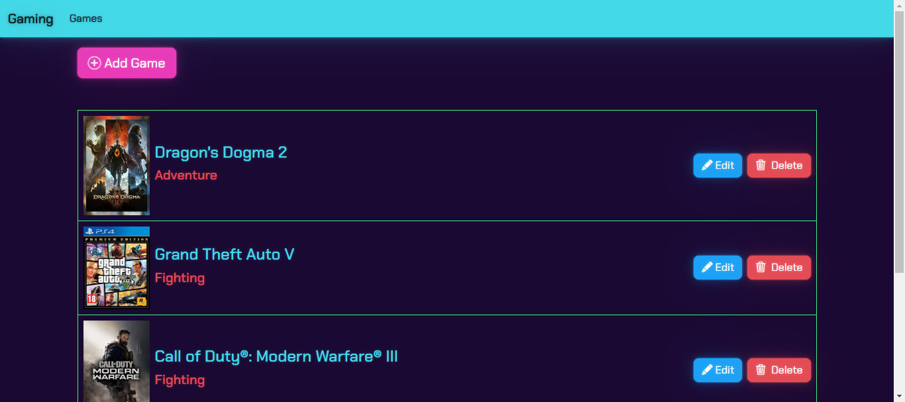
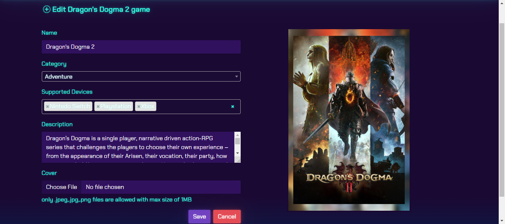

# Gaming - ASP.net MVC

This is a an implementation on the MVC framework and CRUD operations that can be performed on a database. 
## Table of contents

- [Overview](#overview)
  - [The challenge](#the-challenge)
  - [Screenshot](#screenshot)
  - [Links](#links)
- [My process](#my-process)
  - [Built with](#built-with)

## Overview

### The challenge

Users should be able to:

- Add a new game to the database
- edit an existing game
- delete an existing game
- list all the games stored in the database

### Screenshot

### Links

- Solution URL: [solution](https://github.com/engatef2012/Gaming)

## My process

### Built with

- bootstrap-icons@1.11.3
- select2@4.0.13
- sweetalert2@11.10.7
- Semantic HTML5 markup
- ASP.net MVC
- EFcore
- Microsoft SQL Server
